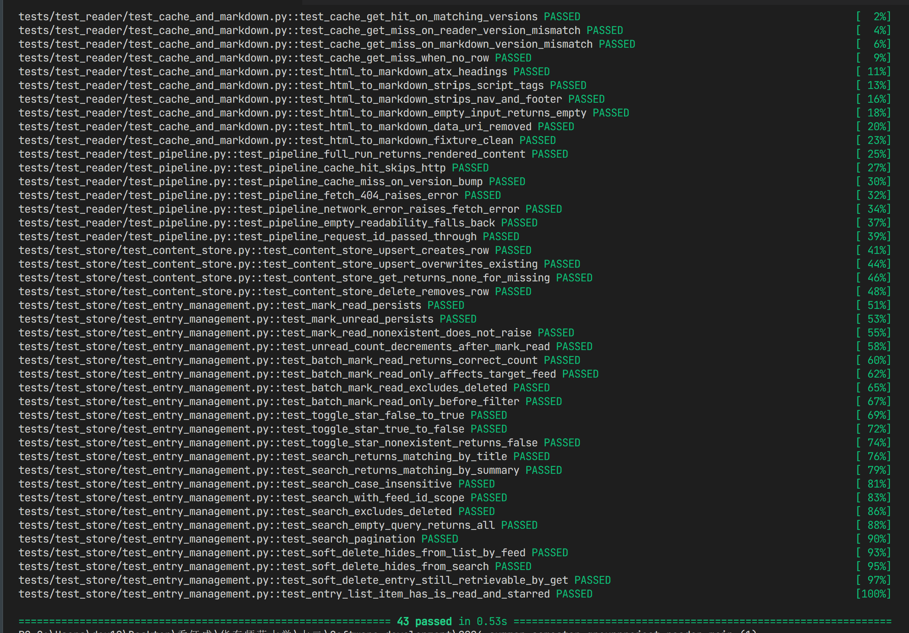
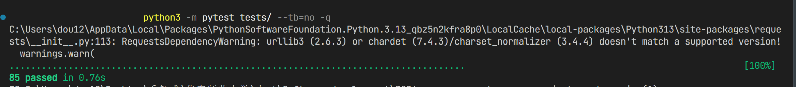
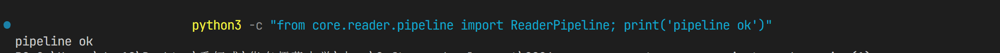
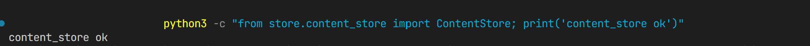
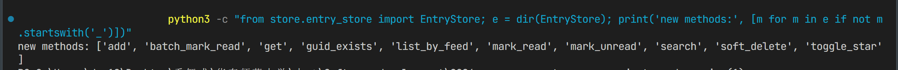

# Mercury 跨平台 RSS 阅读器 — Phase 2 开发验收报告

> **成员 A：** 乔钰成（核心架构师）
> **验收日期：** 2026-07-12
> **运行环境：** Python 3.13.14 · pytest 9.1.1 · Windows 10/11
> **Phase 2 新增测试：** ✅ **43 passed · 0 failed · 0.53s**
> **全量回归（Phase 1 + Phase 2）：** ✅ **85 passed · 0 failed · 0.76s**

---

## 一、本地验收方法

在终端进入仓库目录后，按以下三条命令顺序执行：

```powershell
# 进入仓库目录
cd "C:\Users\dou12\Desktop\乔钰成\华东师范大学\大二\Software_development\2026-summer-semester-groupproject-reader-main (1)\2026-summer-semester-groupproject-reader-main"

# ① 只跑 Phase 2 新增的 43 个测试
python3 -m pytest tests/test_reader/ tests/test_store/test_content_store.py tests/test_store/test_entry_management.py -v

# ② 全量回归（Phase 1 + Phase 2 共 85 个）
python3 -m pytest tests/ --tb=no -q

# ③ 验证三个核心模块可以正常导入 + 新方法存在
python3 -c "from core.reader.pipeline import ReaderPipeline; print('pipeline ok')"
python3 -c "from store.content_store import ContentStore; print('content_store ok')"
python3 -c "from store.entry_store import EntryStore; e = dir(EntryStore); print('new methods:', [m for m in e if not m.startswith('_')])"
```

---

## 二、本地验收截图

### 截图 1 — Phase 2 新增 43 个测试全部通过



> 覆盖范围：`test_reader/test_cache_and_markdown.py`（10 个）+ `test_reader/test_pipeline.py`（7 个）+
> `test_store/test_content_store.py`（4 个）+ `test_store/test_entry_management.py`（22 个）

---

### 截图 2 — 全量回归 85 passed（Phase 1 + Phase 2 零回归）



> 命令：`python3 -m pytest tests/ --tb=no -q`
> 证明 Phase 2 扩展没有破坏任何 Phase 1 的功能

---

### 截图 3 — ReaderPipeline 模块导入验证



> `from core.reader.pipeline import ReaderPipeline` 成功，输出 `pipeline ok`
> 成员 C 可以直接 import 这个管线入口

---

### 截图 4 — ContentStore 模块导入验证



> `from store.content_store import ContentStore` 成功，输出 `content_store ok`

---

### 截图 5 — EntryStore 新增方法列表验证



> 输出中可见 Phase 2.2 新增的全部 6 个方法：
> `batch_mark_read` · `mark_read` · `mark_unread` · `search` · `soft_delete` · `toggle_star`

---

## 三、Phase 2 做了什么

Phase 2 的任务是给 Phase 1 建好的"地基"上**盖起核心功能**——用户点击一篇文章后能看到完整正文（Reader 管线），以及对文章进行管理（已读、收藏、搜索、删除）。

### 两个里程碑

| 里程碑 | 内容 | 新增/扩展文件 |
|--------|------|-------------|
| **M2.1 Reader 管线** | Fetch → Extract → Convert → Render → Cache 五阶段管线 | 5 个新文件 |
| **M2.2 文章管理扩展** | `EntryStore` 新增 6 个 async 方法 | 扩展 1 个文件 |

### M2.1 Reader 管线流程

用户点开一篇文章后，后台依次执行：

```
① Fetch      httpx 去文章原始 URL 抓取完整 HTML（timeout=15s，跟随重定向）
      ↓
② Extract    readability-lxml 剥离广告/导航栏/侧边栏，只保留正文
      ↓
③ Convert    BeautifulSoup 预处理 + markdownify 将干净 HTML 转为 Markdown
      ↓
④ Render     mistune 将 Markdown 渲染为 HTML（供 QWebEngineView.setHtml() 直接使用）
      ↓
⑤ Cache      结果写入 content 表，下次打开同一篇文章直接读缓存，不重新抓取
```

**缓存版本机制**：管线维护 `READER_VERSION` / `MARKDOWN_VERSION` 两个常量，
算法升级时递增版本号，旧缓存自动失效触发重新抓取。

**失败回退**：readability 提取正文为空时（页面反爬或内容过短），
自动回退到使用 RSS 的 `summary` 字段拼简单 HTML，不抛异常，不阻断流程。

### M2.2 文章管理扩展

在 `store/entry_store.py` 中新增 6 个方法，供成员 C 的 UI 层调用：

| 方法 | 作用 | 返回值 | 典型用途 |
|------|------|--------|---------|
| `mark_read(id)` | 标记单篇已读 | `None` | 用户打开文章时自动调用 |
| `mark_unread(id)` | 标记单篇未读 | `None` | 右键菜单"标记未读" |
| `batch_mark_read(feed_id, only_before)` | 批量全读，可按时间过滤 | `int`（标记数量）| 工具栏"全部标为已读" |
| `toggle_star(id)` | 切换收藏状态 | `bool`（新状态）| 收藏按钮，返回值直接更新图标 |
| `search(query, feed_id, limit, offset)` | 标题+摘要关键词搜索 | `list[EntryListItem]` | 搜索框 |
| `soft_delete(id)` | 软删除（保留物理数据）| `None` | 右键菜单"删除" |

---

## 四、测试做了什么，验证了什么

### Phase 2 新增：43 个测试

#### ContentStore（4 个）— 验证"缓存存储层可靠"

| 测试名 | 验证内容 |
|--------|---------|
| `test_content_store_upsert_creates_row` | upsert 正确写入全部字段，`fetched_at` 自动生成 |
| `test_content_store_upsert_overwrites_existing` | 重复 upsert 只有 1 行，不产生重复记录 |
| `test_content_store_get_returns_none_for_missing` | 不存在的 `entry_id` 返回 `None` 而非报错 |
| `test_content_store_delete_removes_row` | 删除后 `get_by_entry()` 返回 `None` |

#### ReaderCache + Markdown 转换（10 个）— 验证"版本号缓存和噪声过滤正确"

| 测试名 | 验证内容 |
|--------|---------|
| `test_cache_get_hit_on_matching_versions` | 版本号完全匹配时命中缓存，返回已存储的 Markdown |
| `test_cache_get_miss_on_reader_version_mismatch` | `READER_VERSION` 不一致时返回 `None`（缓存失效）|
| `test_cache_get_miss_on_markdown_version_mismatch` | `MARKDOWN_VERSION` 不一致时返回 `None`（缓存失效）|
| `test_cache_get_miss_when_no_row` | 数据库无记录时返回 `None` |
| `test_html_to_markdown_atx_headings` | `<h1>` 转换为 `# ` 格式（ATX 风格） |
| `test_html_to_markdown_strips_script_tags` | `<script>` 标签连同 `alert('xss')` 内容一起删除 |
| `test_html_to_markdown_strips_nav_and_footer` | `<nav>` / `<footer>` 连同内容完整移除 |
| `test_html_to_markdown_empty_input_returns_empty` | 空字符串输入直接返回空字符串 |
| `test_html_to_markdown_data_uri_removed` | `data:image/...` base64 内嵌图被正则过滤掉 |
| `test_html_to_markdown_fixture_clean` | 对标准文章 fixture 转换结果包含正确 ATX 标题 |

#### ReaderPipeline（7 个）— 验证"管线端到端行为正确"

| 测试名 | 验证内容 |
|--------|---------|
| `test_pipeline_full_run_returns_rendered_content` | 完整运行返回非空 `RenderedContent`，`from_cache=False` |
| `test_pipeline_cache_hit_skips_http` | 第二次调用不发 HTTP 请求，`from_cache=True` |
| `test_pipeline_cache_miss_on_version_bump` | `READER_VERSION` 改为 2 后缓存失效，重新抓取 |
| `test_pipeline_fetch_404_raises_error` | mock HTTP 404 时抛 `ReaderFetchError`，`status_code=404` |
| `test_pipeline_network_error_raises_fetch_error` | 网络连接失败抛 `ReaderFetchError` |
| `test_pipeline_empty_readability_falls_back` | readability 返回空时回退到 summary，不报错 |
| `test_pipeline_request_id_passed_through` | `request_id` 原样透传到返回值，供 UI 防止过期渲染 |

#### EntryStore 文章管理（22 个）— 验证"文章操作语义正确"

| 测试组 | 数量 | 验证重点 |
|--------|------|---------|
| `mark_read / mark_unread` | 4 | 状态持久化 / 不存在 ID 静默忽略 / `unread_count` 联动减少 |
| `batch_mark_read` | 4 | 返回数量准确 / 只影响目标 Feed / 排除软删除文章 / `only_before` 时间过滤 |
| `toggle_star` | 3 | False→True / True→False 双向 / 不存在 ID 返回 `False` |
| `search` | 7 | 标题匹配 / 摘要匹配 / 大小写不敏感 / Feed 范围 / 排除软删除 / 空查询返回全部 / 分页 |
| `soft_delete` | 3 | `list_by_feed` 隐藏 / `search` 隐藏 / `get()` 仍可访问（`is_deleted=True`）|
| `EntryListItem` 字段 | 1 | `is_read` 和 `is_starred` 字段存在且类型为 `bool` |

### Phase 1 全量回归：42 个

Phase 2 开发完成后，Phase 1 的全部 42 个测试继续全部通过，无任何回归。

---

## 五、开发中遇到并解决的问题

| # | 问题 | 原因 | 解决方案 |
|---|------|------|---------|
| 1 | `markdownify` 的 `strip` 参数只删标签不删文本 | 该版本（1.2.3）`strip` 仅移除 HTML 标签本身，保留标签内的文字内容 | 改用 `BeautifulSoup.decompose()` 预处理，彻底连同内容一起删除噪声标签 |
| 2 | `readability-lxml` 依赖链缺失 | `--no-deps` 安装跳过了传递依赖 `lxml_html_clean`、`chardet`、`beautifulsoup4` | 逐一补装，已完整记录依赖关系 |

---

## 六、成员 A → 成员 C Phase 2 接口移交清单

Phase 2 完成后以下接口已稳定，成员 C 可直接调用（详见 `INTERFACE.md` 第 9～11 节）：

| 接口 | 文件 | 说明 |
|------|------|------|
| `ReaderPipeline.build(entry_id, request_id)` | `core/reader/pipeline.py` | 管线唯一入口，返回 `RenderedContent` |
| `RenderedContent.html` | `core/reader/pipeline.py` | 直接传给 `QWebEngineView.setHtml()` |
| `ReaderFetchError` | `core/reader/pipeline.py` | 网络/HTTP 错误，含 `entry_id` 和 `status_code` |
| `ContentStore.delete_by_entry(id)` | `store/content_store.py` | 主动清除缓存，触发下次强制重新抓取 |
| `EntryStore` 新增 6 个方法 | `store/entry_store.py` | 见上方表格 |

**成员 C 接入 Reader 的最简示例：**

```python
from core.reader.pipeline import ReaderPipeline, ReaderFetchError
from app.state import state
import uuid

pipeline = ReaderPipeline(state.db)

@asyncSlot()
async def on_entry_selected(self, entry_id: int) -> None:
    req_id = str(uuid.uuid4())
    self._pending_req = req_id          # 记住当前请求
    try:
        result = await pipeline.build(entry_id, request_id=req_id)
    except ReaderFetchError:
        self._show_error()
        return
    if self._pending_req != req_id:
        return                          # 用户已切换文章，丢弃过期结果
    self.web_view.setHtml(result.html)  # 渲染正文
```

---

## 七、TASK 完成情况

```
spec/phase2-reader-pipeline/TASK.md     93 条  全部 [x]
spec/phase2-entry-management/TASK.md    79 条  全部 [x]
─────────────────────────────────────────────────────
Phase 2 合计：172 条，全部 [x]，0 条未完成
```

---

*报告生成：2026-07-12 · 成员 A 乔钰成*
